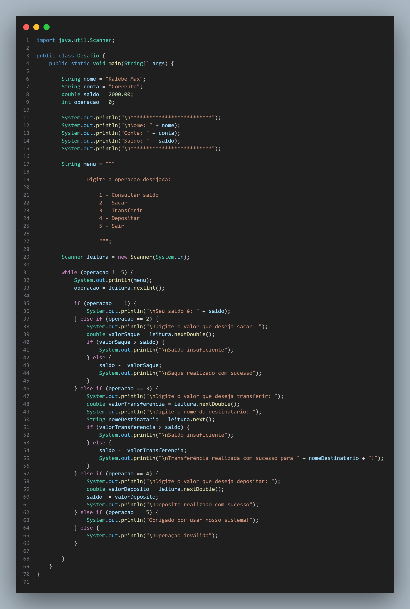

# 💰 Desafio Conta

Projeto desenvolvido como parte de um desafio de lógica de programação, utilizando a linguagem **Java**.

## 📷 Imagem do Código

## 🔍 Funcionamento

O projeto simula uma conta bancária básica com operações como:

- Consulta de saldo
- Realização de depósitos
- Realização de saques

## 🛠 Tecnologias Utilizadas

- ☕ Java
- 🖥️ Visual Studio Code (VS Code)
- 🗃️ Git
- 🐙 GitHub
